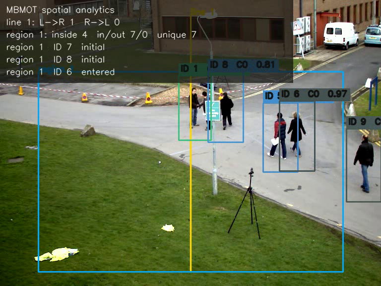

# MBMOT

MBMOT 是一个用 MoonBit 编写的在线多目标跟踪库。它不读取图片，也不绑定某个检测模型；调用方逐帧交给它检测框、置信度和类别，得到按 `track_id` 排序的可见轨迹，以及本帧进入 `lost` 或 `removed` 的编号。仓库中的 `analytics` 包还可以把这条身份流转成越线、区域进出、占用、唯一目标数和停留帧数。

[在线体验](https://python123-ops.github.io/mbmot/) 会在浏览器中加载 MoonBit 的 JavaScript 产物，重放 90 帧检测流。页面可以调整有向线和多边形区域、查看统计，并导出轨迹与空间事件 NDJSON；默认录像的检测已经预先生成，浏览器不执行检测模型推理。

跟踪器采用八维 `xyah + velocity` 运动状态。高分检测先与活动、暂定和仍在保留期内的 lost 轨迹关联，未匹配的活动轨迹再尝试低分检测。低分框能维持正在活动的身份，但不会新建编号或恢复已经 lost 的轨迹。

## 安装与源码运行

在 MoonBit 模块中加入 `0.2.0`：

```bash
moon add python123-ops/mbmot@0.2.0
```

这个版本包含跟踪、空间事件、NDJSON 编解码、MOT 文件读写与评测，以及网站使用的 JavaScript 桥接源码。

需要安装 MoonBit 工具链。检出仓库后可以运行四个稳定后端的检查和测试：

```bash
moon fmt --check
moon check --target all --deny-warn
moon test --target all --deny-warn
```

核心包的基本调用如下：

```moonbit
let tracker = @mbmot.Tracker::new(@mbmot.TrackerConfig::default())
let box = @mbmot.BoundingBox::new(12.0, 20.0, 52.0, 80.0)
let detection = @mbmot.Detection::new(box, 0.91, 0)
let frame = tracker.update(1, [detection])

let track = frame.tracks()[0]
assert_eq(track.track_id(), 1)
assert_eq(track.hits(), 1)
```

仓库源码还提供逐帧 YOLO 中心框的转换命令。每行写明 `frame`、图像 `width` / `height`、`coordinates`（`normalized` 或 `pixels`），以及含 `cxcywh`、`score`、`class_id` 的检测列表；转换结果正是现有 replay 工具的输入。下面的两帧分别使用归一化和像素坐标，指向同一个框：

```bash
moon run src/yolo_import --target native < examples/yolo.ndjson
moon run src/yolo_import --target native -- --classes '[2]' < examples/yolo.ndjson
```

这个源码接口尚未随 `0.2.0` 发布。归一化框必须完整位于 `[0,1]`；像素框可以伸出图像，但仍须具有有限坐标和正面积。类别筛选只决定哪些合法检测进入输出，不会掩盖被排除类别中的格式错误。错误带物理输入行号并以非零状态退出，此前已输出的完整行仍可使用。

`BoundingBox::from_xywh` 接受左上角加宽高，`BoundingBox::from_cxcywh` 接受中心点加宽高，后者可直接承接 YOLO 常见的坐标顺序。两种构造都保留输入尺度：像素坐标和归一化坐标可以使用，但同一条流必须保持一致，库不会读取图像尺寸替调用方缩放。

## 逐帧契约

边界框使用连续坐标 `xyxy`，面积不采用像素端点的 `+1` 约定。坐标必须有限且满足 `x2 > x1`、`y2 > y1`；置信度位于 `[0, 1]`，类别编号非负。不同类别永不关联。

`frame_id` 必须严格递增。跳帧按实际帧差推进运动和失踪时间，因此一次跳过若干帧与逐帧提交空检测会到达相同的内部状态。任何非法帧都会整帧拒绝，不消耗编号，也不部分更新已有轨迹。

公开的 `Track::bbox()` 始终是最近一次真实检测框；预测框只参与关联。`Tracker::status()` 可读取活动、暂定和 lost 数量，但不会暴露协方差或预测位置。`reset()` 会清空流状态，并让下一个身份重新从 1 开始。

默认参数如下：

| 参数 | 值 | 作用 |
| --- | ---: | --- |
| `high_score_threshold` | 0.25 | 第一阶段检测下限 |
| `low_score_threshold` | 0.10 | 第二阶段检测下限 |
| `new_track_threshold` | 0.25 | 新建身份的最低分数 |
| `first_match_max_cost` | 0.80 | 高分关联最大代价 |
| `second_match_max_cost` | 0.50 | 低分关联最大代价 |
| `max_lost_frames` | 30 | lost 身份的保留帧数 |
| `min_hits` | 1 | 轨迹可见前所需命中数 |
| `fuse_score` | `true` | 第一阶段是否融合检测分数 |

## 从轨迹到空间事件

`python123-ops/mbmot/analytics` 接受 MBMOT 的 `FrameTracks`，也接受由其他跟踪器构造的 `TrackSample`。下面的组合调用使用检测框底边中心作为规则判定点：

```moonbit
let analyzer = @analytics.SpatialAnalyzer::new(
  @analytics.AnalyticsConfig::default(),
  [
    @analytics.DirectedLine::new(
      4,
      @analytics.Point::new(320.0, 0.0),
      @analytics.Point::new(320.0, 720.0),
    ),
  ],
  [
    @analytics.PolygonRegion::new(
      7,
      [
        @analytics.Point::new(100.0, 100.0),
        @analytics.Point::new(540.0, 100.0),
        @analytics.Point::new(540.0, 620.0),
        @analytics.Point::new(100.0, 620.0),
      ],
    ),
  ],
)

let tracked = tracker.update(frame_id, detections)
let spatial = analyzer.update_mbmot(frame_id, tracked)
for event in spatial.events() {
  // LineCrossed / RegionEntered / RegionExited
  consume(event)
}
```

有向线从 `start` 指向 `end`，越线方向是 `LeftToRight` 或 `RightToLeft`。区域初次观测就在内部时，`RegionEntered` 的 `initial` 为 `true`；从外部进入时为 `false`。`RegionExited` 的 `dwell_frames` 使用真实帧号差，因此跳帧不会被压缩成一帧。

默认需要连续两次明确位于新一侧才确认状态变化。点落在线或多边形边界时不推进证据。`lost` 身份不计入当前占用，但保留区域归属和进入帧；恢复后不会重复报告进入，也不会根据未观测路径推断越线。`removed` 清理身份的临时状态，累计统计仍保留。

规则与轨迹必须使用同一坐标尺度。分析器不读取图像尺寸，也不会在像素和归一化坐标之间自动转换。帧号不递增、轨迹编号重复或冲突、类别变化和已移除编号的复用都会整帧拒绝。

一条检测流同时包含多种目标时，可以让每条规则只观察指定类别。例如下面的计数线只处理 `class_id` 为 `0` 或 `2` 的轨迹，其他轨迹仍会由跟踪器输出，但不会推进这条线的去抖状态或累计计数：

```moonbit
let selected_line = @analytics.DirectedLine::for_classes(
  12,
  @analytics.Point::new(320.0, 0.0),
  @analytics.Point::new(320.0, 720.0),
  [0, 2],
)
```

`PolygonRegion::for_classes` 对区域采用相同语义。原有的 `DirectedLine::new` 和 `PolygonRegion::new` 仍接受所有类别；筛选列表必须非空、无重复且只包含非负编号，内部会按编号排序，因此输入顺序不会影响结果。

每帧结果同时保留规则总计和分类明细。`AnalyticsFrame::line_class_counts()` 按“计数线编号、类别编号”返回双向累计值；`region_class_counts()` 按“区域编号、类别编号”返回进入、离开、唯一身份和当前占用。分类项在该类别第一次被对应规则接受时出现，即使尚未发生越线或进入事件也会返回零值，调用方因此可以直接绘制稳定的分类面板。lost 目标会立即退出当前分类占用，但已经累计的进入和唯一身份不会丢失。

当前源码中的计数线还分别给出两个方向的唯一轨迹数：同一个身份反复越线会增加越线次数，但在同一方向只计为一个唯一身份。区域结果增加观测期间的峰值占用，以及仅在确认退出时累加的 `completed_dwell_frames`；lost 或 removed 不会凭空结束一次停留。`transition_counts` 记录同一身份确认离开一个区域后、再确认进入另一区域的次数，按来源区域、目标区域和类别排序。首次出现于区域内部不算转移，lost 会切断尚未完成的转移；当一帧同时退出多个重叠区域时，选编号最小的区域作为来源。

仓库内的六帧样例依次展示进入、越线、短暂丢失、恢复和退出：

```bash
moon run src/analytics_demo --target native
```

命令的六行输出与 [`examples/analytics.expected.txt`](examples/analytics.expected.txt) 逐字比较。样例为了在六帧中展示完整事件链，显式使用 `stable_frames = 1`。

外部跟踪器也可以通过 NDJSON 使用同一分析逻辑。原生命令先读取一行规则配置，后续每行接收一帧可见轨迹与生命周期编号：

```json
{"config":{"anchor":"bottom_center","stable_frames":1},"lines":[{"id":4,"start":[5,0],"end":[5,10],"class_ids":[0]}],"regions":[{"id":7,"vertices":[[0,0],[10,0],[10,10],[0,10]],"class_ids":[0]}]}
{"frame":1,"tracks":[{"track_id":1,"xyxy":[-3,2,-1,5],"class_id":0}],"lost":[],"removed":[]}
```

在 Bash 中重放完整样例：

```bash
moon run src/analytics_replay --target native < examples/analytics.ndjson
```

配置行不产生输出，每个帧行产生一个 JSON 对象。其中 `events` 是本帧确认的越线或区域状态变化，`line_counts` 和 `region_counts` 是截至当前帧的规则总计，`line_class_counts` 和 `region_class_counts` 给出同一结果的类别拆分，`transition_counts` 列出已确认的跨区域转移，`occupants` 列出当前可见的区域内身份及停留帧数。完整输出保存在 [`examples/analytics.expected.ndjson`](examples/analytics.expected.ndjson)，CI 会逐字比较两者。

规则对象中的 `class_ids` 可以省略；省略时接受全部类别，提供时采用与 MoonBit API 相同的非空、非负和无重复约束。

输入可以来自 MBMOT、其他跟踪器或已经保存的轨迹文件，只需提供正整数 `track_id`、合法 `xyxy`、非负 `class_id`，并保证 `lost`、`removed` 与可见集合不冲突。空白行会被忽略；其他错误携带物理行号并以非零状态退出，错误前已经输出的完整帧仍然有效。

## 录像演示

`tools/video_demo/video_demo.py` 把录像拆成“检测、MoonBit 跟踪、MoonBit 空间分析、画面渲染”四段。默认检测器是 OpenCV 自带的全身行人 HOG，不需要下载模型；已有 YOLO 或其他检测器时，可直接传入与检测流重放相同的 NDJSON。

PowerShell 中建立隔离环境并处理一段录像：

```powershell
py -3 -m venv .venv-video-demo
.\.venv-video-demo\Scripts\python.exe -m pip install -r tools\video_demo\requirements.txt
.\.venv-video-demo\Scripts\python.exe tools\video_demo\video_demo.py `
  --source input.mp4 `
  --output input.mbmot.mp4 `
  --config examples\video-demo-config.json
```

也可以先录制摄像头 300 帧，再自动完成后续跟踪和渲染：

```powershell
.\.venv-video-demo\Scripts\python.exe tools\video_demo\video_demo.py `
  --source 0 `
  --max-frames 300 `
  --output camera.mbmot.mp4 `
  --config examples\video-demo-config.json
```

渲染画面包含检测框、`track_id`、类别和最近分数，并叠加有向线、多边形、双向计数、区域占用、唯一目标数和最近事件。同名 `-artifacts` 目录保留 `detections.ndjson`、`tracks.ndjson`、`analytics.ndjson` 和转换为像素坐标后的规则，可以单独检查每一段输出。

外部检测结果的每行格式为：

```json
{"frame":1,"detections":[{"xyxy":[120,80,260,410],"score":0.91,"class_id":0}]}
```

传入时增加 `--detections detections.ndjson`，演示程序便不再运行 HOG。这个接入面不限制 YOLO 版本或推理框架。`examples/video-demo-config.json` 使用归一化规则坐标，运行时按录像宽高转成像素坐标。

当前演示是离线双遍处理：第一遍生成检测和 MoonBit 结果，第二遍渲染录像。它不保留原视频音轨；OpenCV HOG 只用于全身行人演示，车辆、工件或更复杂视角应提供外部检测流。

仓库中保留了一段可直接查看的 90 帧输出：



[播放 MBMOT 空间分析录像](examples/video/mbmot-spatial-demo.mp4)。原始画面来源和样例口径记录在 [`examples/video/README.md`](examples/video/README.md)。

## NDJSON 重放

原生重放命令从标准输入逐行读取：

```json
{"frame":1,"detections":[{"xyxy":[0,0,10,10],"score":0.95,"class_id":0}]}
```

在 Bash 中运行仓库内的四帧样例：

```bash
moon run src/replay --target native < examples/replay.ndjson
```

PowerShell 可以通过 `cmd` 使用同一个输入文件：

```powershell
cmd /c "moon run src/replay --target native < examples\replay.ndjson"
```

每个成功输入行产生一个输出行：

```json
{"frame":1,"tracks":[{"track_id":1,"xyxy":[0,0,10,10],"score":0.95,"class_id":0,"first_frame":1,"last_frame":1,"hits":1}],"lost":[],"removed":[]}
```

字段顺序和轨迹顺序固定，仓库中的 [`examples/replay.expected.ndjson`](examples/replay.expected.ndjson) 是完整样例输出。遇到 JSON、检测值或帧号错误时，命令把物理输入行号写到标准错误并以非零状态退出；此前已经写出的完整输出行仍然有效。

MBMOT 处理单摄像头、轴对齐检测框，不使用外观特征。身份延续由类别、运动预测、IoU、检测分数和生命周期共同决定。

## MOT 序列评测

仓库中的 `evaluation` 包读取 MOTChallenge 的逗号分隔二维框。标注文件接受九列或十列，第七列为零的标注不参与计数；跟踪结果要求十列，并可由 `encode_tracker_results` 生成。默认按 `IoU >= 0.5` 匹配，报告 TP、FP、FN、身份切换、MOTA、平均匹配 IoU（MOTP）以及 IDP、IDR、IDF1。

原生命令接收标注和跟踪结果两个文件：

```bash
moon run src/evaluate --target native examples/mot/ground-truth.txt examples/mot/tracker-results.txt
```

已有 MOTChallenge 检测文件时，可以先由 MBMOT 生成十列轨迹结果。检测行接受常见的七列或十列形式；文件无需预先按帧排序，同一帧内仍保留原检测顺序：

```bash
moon run src/mot_track --target native --release \
  examples/mot/detections.txt tracks.txt
```

仓库样例会输出：

```json
{"match_iou_threshold":0.5,"frames":3,"ground_truth_detections":3,"tracker_detections":4,"true_positives":3,"false_positives":1,"false_negatives":0,"identity_switches":1,"mota":0.3333333333333333,"motp":1,"id_true_positives":2,"id_false_positives":2,"id_false_negatives":1,"id_precision":0.5,"id_recall":0.6666666666666666,"idf1":0.5714285714285714}
```

这里的评测用于自有序列回归，不执行 MOTChallenge 对行人类别、遮挡区域和 distractor 类别的官方预处理。需要提交排行榜时，应再用 [TrackEval](https://github.com/JonathonLuiten/TrackEval) 复核同一份轨迹结果。

仓库中的 [`benchmarks/MOT17-02-FRCNN.md`](benchmarks/MOT17-02-FRCNN.md) 记录了一次完整训练序列运行的输入哈希、参数、原始计数和 TrackEval 复核结果。该记录得到 HOTA 34.895、MOTA 32.404、IDF1 39.606 和 111 次身份切换；它是可复算的训练序列结果，不是测试集排行榜成绩。

## License

[MIT](LICENSE)
